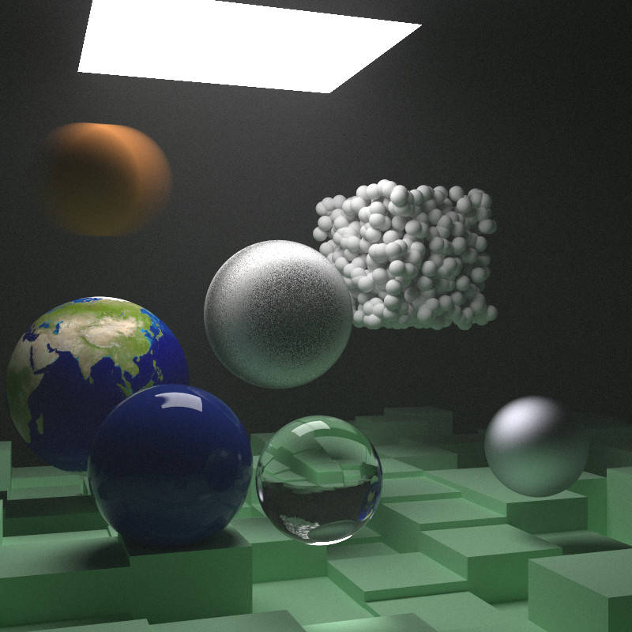
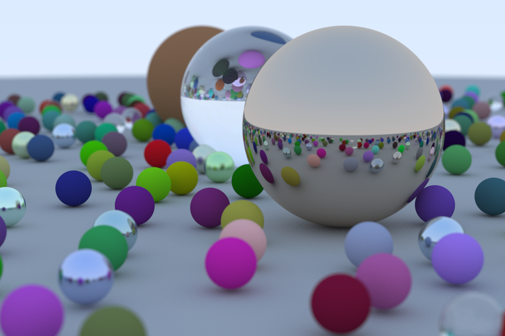
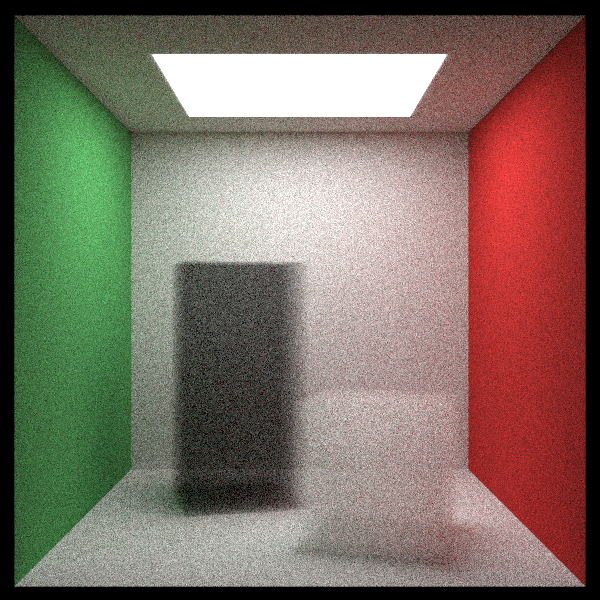
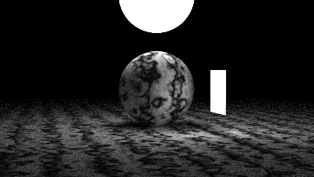
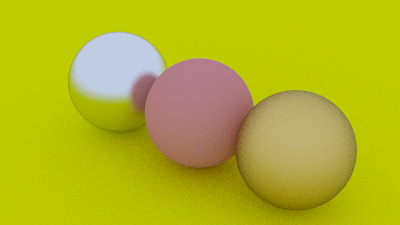

# 3d-raytracer-lua

> A simple 3D raytracer written in Lua over a couple of weekends.

Some time ago I wanted to learn more about 3D raytracers, so I read these two books by Peter Shirley and then translated the C++ code from the books into Lua:
- [_Ray Tracing in One Weekend_](https://raytracing.github.io/v3/books/RayTracingInOneWeekend.html)
- [_Ray Tracing: The Next Week_](https://raytracing.github.io/v3/books/RayTracingTheNextWeek.html)

> [!NOTE]
> I read version 3 of the books. There are newer versions now.

This raytracer is obviously not production-ready or really anything to be taken seriously, but I had a lot of fun writing it!  
I decided to use Lua because it's a very minimal and limited language, which makes it even more fun, but it's obviously not the fastest language out there, so if you want to try it, you'll have to clear your schedule. 😅  
The final render seen below took almost a week to render... Don't ask. Sorry Planet Earth!

All the code is written by me, but I added a MIT license so feel free to use it however you like.


## Results








## How to try

Download the repository and then run any of the scenes using LuaJIT:
```bash
luajit ./scenes/<scene>.lua
```
> [!NOTE]
> You can also use standard Lua 5.1, but I _**highly recommend**_ using LuaJIT instead.
> Also, to use standard Lua you have to install the [Lua BitOp extension](https://bitop.luajit.org/), which is included in LuaJIT.

After the rendering is finished, you can find the resulting PPM file in `./results/`.  
To convert the PPM file to a PNG/JPEG file, I recommend using [GIMP](https://www.gimp.org/) or [ImageMagick](https://imagemagick.org/).
